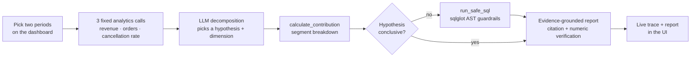
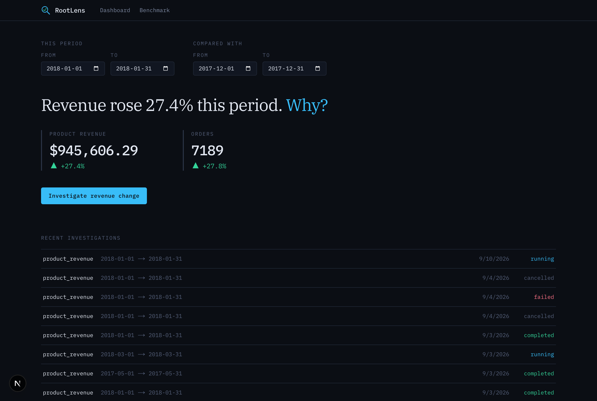
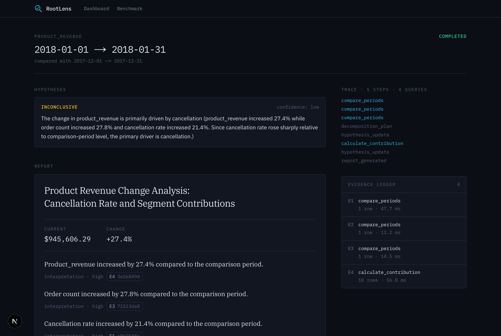
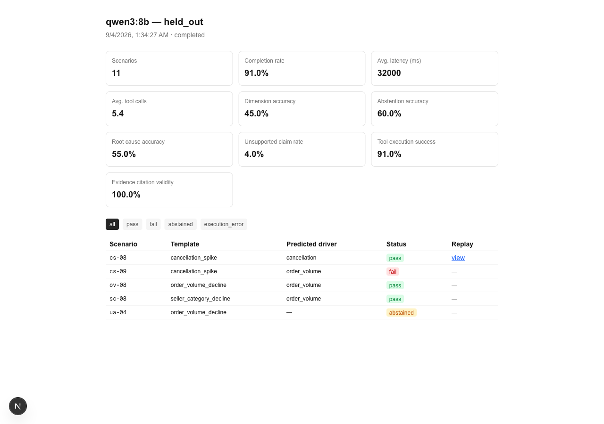

<div align="center">
  

  # RootLens

  ### A local-first AI business analyst that investigates *why* a metric changed — not just that it did

  [](LICENSE)
  [](#status)
  [](apps/api)
  [](apps/web)
  [](db)
  [](https://ollama.com)
  [](https://github.com/Bruce1508/RootLens/stargazers)

</div>

<br>

RootLens takes a two-period metric comparison and turns it into a
**grounded investigation**: it runs a bounded sequence of real SQL
queries against your data, forms and tests hypotheses about what
changed, and produces a report where every claim links back to the
executed query and rows that support it — no citation, no claim. It
runs entirely on your machine, against a local Ollama model, with zero
calls to a paid LLM API.

See [`RootLens_PRD.md`](RootLens_PRD.md) for the full product
requirements document this was built against.

> [!NOTE]
> RootLens is a completed **portfolio MVP**, not a maintained product.
> All 7 milestones in the PRD (M0–M6) are implemented, tested, and
> documented — see [Status](#status) below for exactly what that means
> and what's explicitly out of scope.

<br>

## Contents

- [The investigation loop](#the-investigation-loop)
- [What RootLens does](#what-rootlens-does)
- [Screenshots](#screenshots)
- [Status](#status)
- [Prerequisites](#prerequisites)
- [Quickstart](#quickstart)
- [Running the incident benchmark](#running-the-incident-benchmark)
- [Commands](#commands)
- [Repository layout](#repository-layout)
- [Architecture decisions](#architecture-decisions)
- [Known limitations](#known-limitations)
- [A note on measured vs. planned results](#a-note-on-measured-vs-planned-results)
- [License](#license)

<br>

## The investigation loop



The engine is a **bounded, mostly-deterministic script, not a free-form
agent loop** (a deliberate PRD scope choice, not a limitation of the
approach): three fixed analytics calls feed one LLM decomposition
decision, which picks one drill-down dimension. The model only gets a
genuinely open-ended move — one ad hoc, AST-guarded SQL query — when
that standard path leaves a hypothesis inconclusive. Every step checks
its step/query/wall-clock budget and a `cancel_requested` flag the UI
can set mid-run. See
[`docs/architecture/overview.md`](docs/architecture/overview.md) for
the full request-flow diagrams, including database roles and schemas.

<br>

## What RootLens does

- **Runs a real investigation, not a chat completion.** Every finding
  in the final report cites an `evidence_id` that opens the exact SQL
  and rows it came from — unknown or fabricated citations are rejected
  automatically before a report ships.
- **Knows when to say "I don't know."** Unsupported or unanswerable
  questions produce an explicit insufficient-evidence response instead
  of a confident-sounding guess.
- **Guards its one escape valve.** The agent's only ad hoc SQL tool is
  parsed with `sqlglot`, restricted to a table allowlist, capped on
  joins and row count, and executed under the Postgres read-only role
  — mutation is impossible, not just discouraged.
- **Runs against real data.** A 35-scenario incident benchmark
  (cancellation spikes, order-volume declines, seller/category
  declines, and unanswerable questions) with hidden ground truth,
  scored on accuracy, hallucination, and latency — see [Running the
  incident benchmark](#running-the-incident-benchmark).
- **Costs nothing to run.** Local Ollama model, no OpenAI/Anthropic/
  Google API keys, no Redis, no distributed job system — a Postgres
  instance and a local model are the whole footprint.

<br>

## Screenshots

| Dashboard | Investigation | Evaluation |
|---|---|---|
|  |  |  |

<br>

## Status

All 7 milestones in `RootLens_PRD.md` (M0–M6) are complete: ingestion,
a bounded investigation loop backed by a local Ollama model,
evidence-backed and citation-verified reports, the 35-scenario incident
benchmark, SQL AST guardrails around the agent's one escape-valve tool,
and a read-only database role enforced for every analytics query the
engine makes — including, since Milestone 6, the engine's own reads.
The dashboard's investigate/history flow (PRD acceptance criterion #4)
is wired end-to-end, not just reachable via the API.

What this *doesn't* mean: RootLens is not under active maintenance,
does not have CI/CD or a hosted deployment, and its [known
limitations](#known-limitations) are recorded deliberately rather than
smoothed over — read them before assuming a given behavior is a bug.

<br>

## Prerequisites

- Docker + Docker Compose
- [`uv`](https://docs.astral.sh/uv/) (Python dependency management)
- Node.js 20+
- [Ollama](https://ollama.com), running locally with a model pulled (e.g.
  `ollama pull qwen3:8b`) — required for investigations and the
  evaluation runner; the dashboard alone doesn't need it
- A Kaggle account, only if you want the full dataset instead of the
  committed fixtures (see `data/README.md`)

<br>

## Quickstart

```bash
make setup      # copies .env.example -> .env, installs backend + frontend deps
make up         # starts postgres, api, web via Docker Compose
make migrate    # applies Alembic migrations
make ingest-fixtures   # loads the small golden fixture dataset (no Kaggle account needed)
make demo       # creates one real investigation and prints its URL
```

Then visit http://localhost:3000 for the dashboard, or
http://localhost:8000/api/health for the backend health check.

To use the full Olist dataset instead of fixtures (needed for the
incident benchmark — see below), follow `data/README.md`, then run
`make ingest SOURCE=data/raw`.

<br>

## Running the incident benchmark

The 35 scenarios (cancellation spikes, order-volume declines,
seller/category declines, and unanswerable questions) are grounded in the
real dataset's volume, not the small fixtures:

```bash
make ingest SOURCE=data/raw   # the real dataset must be loaded first
make eval-seed                # loads the code-defined scenarios + hidden ground truth
make eval-run                 # runs the held-out split, scores it, writes docs/evaluation/results/
```

Results are visible at http://localhost:3000/evaluations once a run
completes. This is a real local benchmark, not a fixed demo — its
measured accuracy will vary with the model and hardware you run it on;
see [`docs/performance.md`](docs/performance.md) for what was actually
observed here.

<br>

## Commands

| Command | What it does |
|---|---|
| `make setup` | Install backend (`uv sync`) and frontend (`npm install`) dependencies |
| `make up` / `make down` | Start / stop the Docker Compose stack |
| `make migrate` | Apply Alembic migrations |
| `make ingest-fixtures` | Load the committed golden fixture dataset |
| `make ingest SOURCE=data/raw` | Load the full Olist dataset (requires manual download) |
| `make db-reset` | Dev-only: truncate and reload fixtures |
| `make demo` | Create one real investigation and print its URL |
| `make eval-seed` / `make eval-run` / `make eval` | Seed and run the incident benchmark |
| `make test` | Run backend (pytest) and frontend (Vitest) tests |
| `make test-e2e` | Run frontend end-to-end tests (Playwright, mocked API) |
| `make lint` / `make format` / `make typecheck` | Quality gates for both apps |

<br>

## Repository layout

```
apps/web/    Next.js dashboard, investigation workspace, evaluation UI
apps/api/    FastAPI backend — models, migrations, ingestion, analytics,
             investigation engine, evaluation runner
data/        Dataset docs, gitignored raw data, committed test fixtures
db/init/     Postgres role bootstrap (runs once, on first container start)
docs/        Architecture notes, ADRs, performance notes, screenshots
scripts/     demo.sh — the Milestone 6 demo entrypoint
```

<br>

## Architecture decisions

See [`docs/decisions/`](docs/decisions/) for the reasoning behind key
choices:

| ADR | Decision |
|---|---|
| [0001](docs/decisions/0001-monorepo-layout.md) | Monorepo layout with `apps/web` and `apps/api` |
| [0002](docs/decisions/0002-backend-stack.md) | Backend stack — FastAPI + SQLAlchemy + Alembic + Pydantic |
| [0003](docs/decisions/0003-python-tooling-uv.md) | Python dependency management with `uv` |
| [0004](docs/decisions/0004-db-roles-from-day-one.md) | App and read-only database roles from Milestone 0 |
| [0005](docs/decisions/0005-metric-catalog-in-code.md) | Semantic metric catalog lives in versioned Python code |
| [0006](docs/decisions/0006-prompt-registry-in-code.md) | Prompt/version registry lives in versioned Python code |
| [0007](docs/decisions/0007-hidden-evaluation-schema.md) | Hidden ground truth lives in a Postgres schema, not a separate database |

<br>

## Known limitations

Recorded here deliberately, not left implicit:

- **The investigation loop is a bounded script, not a fully adaptive
  agent loop.** Three fixed analytics calls feed one decomposition
  decision; the LLM only gets a genuinely open-ended choice (the ad hoc
  `run_safe_sql` step) when the standard path leaves a hypothesis
  inconclusive. This was a deliberate scope choice (PRD §6: "deterministic
  business logic where possible"), not an oversight.
- **Local LLM latency is highly variable**, not proportional to query
  complexity — the same investigation took ~28s in one run and hit the
  120s per-call timeout in another. See `docs/performance.md`.
- **A benchmark scenario targeting a low-volume dimension can be swamped
  by real background variance.** One held-out scenario (a small state)
  showed the *opposite* of its expected direction, because the injected
  incident was small relative to natural month-to-month noise in the
  other 90%+ of the dataset. This is a real, measured limitation of
  scoring against an aggregated top-level metric, not a bug — surfaced
  during Milestone 5, not smoothed over.
- **`rootlens_app` (the Postgres bootstrap role) can still read the
  hidden `eval` schema** despite the schema-level hiding (ADR-0007) —
  it's effectively a superuser. The guardrail is that no application code
  path the investigation engine can reach ever queries it, not a
  database-level wall against every possible role.
- **Evaluation runs are not parallelized** — 35 scenarios run
  sequentially, each provisioning and tearing down its own schema. Not a
  problem at this scale; would need revisiting at materially larger
  scenario counts.

<br>

## A note on measured vs. planned results

Any accuracy, latency, or benchmark numbers in this README or
[`docs/performance.md`](docs/performance.md) are only ever reported
after being actually measured (the evaluation runner, or direct local
timing). Nothing here is a target dressed up as an achieved result.

<br>

## License

[MIT](LICENSE) © 2026 Nguyen Duc Anh Vo. The Olist dataset used for
ingestion and the incident benchmark is licensed separately by its
publisher on Kaggle — see `data/README.md`.
