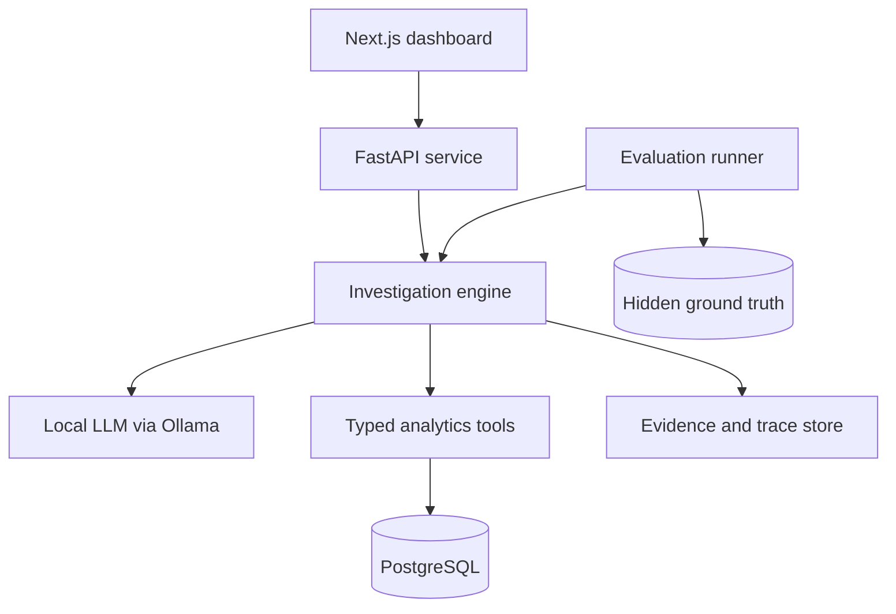

# RootLens

## Product Requirements Document

**Product:** Autonomous Business Investigation Agent  
**Document type:** Product pitch + implementation PRD  
**Version:** 1.0  
**Status:** Ready for technical review and implementation planning  
**Primary builder:** Bruce Vo  
**Target:** Portfolio-grade MVP for 2027 AI/SWE internship recruiting  

---

## 1. Executive Summary

RootLens is a local-first AI business analyst that investigates *why* a business metric changed.

Traditional BI dashboards show that revenue, order volume, delivery performance, or customer ratings changed. Traditional text-to-SQL assistants answer direct questions such as “What was revenue last month?” Neither independently investigates the causes behind a change.

RootLens turns a high-level question such as:

> Why did revenue decline last month?

into a multi-step, evidence-backed investigation. It defines the metric, compares time periods, breaks the change down across business dimensions, creates and tests hypotheses, and returns a conclusion supported by executable SQL evidence.

Every quantitative claim must cite a query result. When the available data cannot support a causal conclusion, RootLens must abstain and explain what additional data is needed.

The initial version runs entirely on a developer laptop using an open-weight model through Ollama. It requires no paid AI API and uses the public Olist Brazilian E-Commerce dataset as its realistic relational data foundation.

### One-line pitch

**RootLens is a local AI analyst that autonomously investigates business anomalies and explains their likely drivers with verifiable database evidence.**

### Why this product matters

- Business teams spend substantial time moving from “the metric changed” to “what contributed to the change?”
- Generic chatbots may produce plausible explanations without sufficient evidence.
- Text-to-SQL systems usually answer one query at a time and do not manage an investigation.
- RootLens makes the investigation process visible, reproducible, and measurable.

---

## 2. Product Vision

RootLens should feel like a careful junior business analyst who:

1. Clarifies the meaning of the requested metric.
2. Builds an investigation plan.
3. Queries only approved data.
4. Forms multiple hypotheses.
5. Tests and updates those hypotheses.
6. Quantifies each contributor to the observed change.
7. Cites the evidence behind every numerical claim.
8. Admits when the available data is insufficient.

The long-term product can support multiple datasets and investigation types. The MVP intentionally focuses on a single, well-evaluated workflow rather than broad but unreliable chat functionality.

---

## 3. Problem Definition

### User problem

A business operator sees a metric change but does not know which markets, products, sellers, customer segments, or operational factors contributed to it. Investigating manually requires writing several SQL queries, choosing useful breakdowns, comparing periods, and synthesizing the results.

### Technical problem

Natural-language questions such as “Why did revenue drop?” do not map to one SQL query. A useful system must combine:

- semantic metric definitions;
- planning and tool selection;
- safe SQL execution;
- iterative hypothesis testing;
- evidence tracking;
- uncertainty and abstention;
- objective evaluation against known scenarios.

### Opportunity

Build a portfolio product at the intersection of software engineering, data engineering, analytics, and AI engineering without depending on paid model APIs.

---

## 4. Goals and Non-Goals

### 4.1 MVP goals

The MVP must:

- import and model the Olist e-commerce dataset in PostgreSQL;
- display a small business KPI dashboard;
- let a user launch a revenue-change investigation for two selected periods;
- use a local LLM through Ollama to orchestrate approved analytics tools;
- perform multiple analysis steps rather than a single text-to-SQL call;
- show the investigation trace in the UI as it runs;
- maintain explicit hypotheses and their statuses;
- produce a final finding with confidence and evidence citations;
- allow users to inspect the SQL and tabular result for each evidence item;
- enforce read-only SQL safety controls;
- abstain when a question cannot be answered from available data;
- evaluate the agent against controlled incidents with hidden ground truth;
- run locally with Docker Compose and documented setup steps.

### 4.2 Portfolio goals

The completed MVP should demonstrate:

- structured LLM outputs and tool calling;
- a custom multi-step agent loop;
- relational schema reasoning and analytics SQL;
- evidence-grounded generation;
- guardrails and failure recovery;
- reproducible AI evaluation;
- observability, latency, and reliability awareness;
- clear product thinking and polished UX.

### 4.3 Non-goals for MVP

The MVP will not include:

- multi-agent orchestration;
- real-time production company integrations;
- autonomous writes or changes to business data;
- arbitrary user-uploaded schemas;
- forecasting or prescriptive optimization;
- a general-purpose research chatbot;
- external web search;
- paid OpenAI, Anthropic, or Google model APIs;
- production authentication, roles, or billing;
- Redis or a distributed job system unless profiling proves it necessary;
- marketing funnel, inventory, campaign, or support-ticket analysis;
- an unrestricted natural-language SQL console.

These may be added only after the core investigation and evaluation loop is reliable.

---

## 5. Target Users

### Primary persona: E-commerce operations manager

Needs to understand why business performance changed but does not want to manually write SQL or inspect many dashboards.

Primary questions:

- Why did revenue decline between two periods?
- Which states, categories, sellers, or customer groups contributed most?
- Was the change caused mainly by fewer orders or lower order value?
- Did delivery performance or review scores deteriorate at the same time?

### Secondary persona: Data analyst or analytics engineer

Uses RootLens to accelerate first-pass investigation, validate the AI’s evidence, inspect SQL, and identify useful follow-up analyses.

### Portfolio evaluator

A recruiter or interviewer should be able to run a prepared scenario, watch the investigation, inspect its evidence, and view benchmark results without learning the entire codebase.

---

## 6. Core Product Principles

1. **Evidence before explanation:** quantitative statements require cited query results.
2. **Visible investigation:** users can see what the agent tested, not hidden chain-of-thought.
3. **Constrained autonomy:** the agent chooses among safe, typed tools and bounded actions.
4. **Deterministic business logic where possible:** metric calculations belong in tested tools, not prompts.
5. **Honest uncertainty:** insufficient evidence produces abstention, not speculation.
6. **Evaluation as a product feature:** agent quality is measured against known incidents.
7. **Local-first and provider-independent:** no paid key is required; model access is abstracted behind an interface.
8. **Build depth before breadth:** one reliable investigation flow is more valuable than many shallow features.

---

## 7. Primary User Journey

### Happy path

1. The user opens the dashboard.
2. The dashboard shows revenue, orders, average order value, cancellation rate, average delivery delay, and average review score for a selected period.
3. The user sees that revenue decreased and clicks **Investigate**.
4. RootLens creates an investigation with the selected current and comparison periods.
5. The UI streams public trace events such as:
   - Resolving the revenue definition.
   - Comparing revenue, orders, and average order value.
   - Measuring contribution by customer state.
   - Inspecting the highest-impact product categories.
   - Testing whether cancellation or delivery performance changed.
6. The hypothesis panel updates each candidate as `untested`, `testing`, `supported`, or `rejected`.
7. RootLens returns a final report containing:
   - the observed metric change;
   - primary and secondary contributors;
   - estimated impact;
   - confidence level;
   - limitations;
   - evidence citations.
8. The user opens an evidence item to inspect its SQL, result table, execution time, and associated claim.

### Example final report

> Revenue decreased 14.8% compared with the previous period [E1]. Lower order volume, rather than average order value, explains most of the decline [E2]. São Paulo contributed 61% of the lost revenue [E3], concentrated in two product categories [E4]. Cancellation rate in those categories increased from 4.2% to 15.7% [E5]. The evidence strongly supports a localized cancellation spike as the primary driver. Confidence: high.

---

## 8. MVP Scope

### 8.1 Supported investigation

The MVP supports one canonical investigation intent:

**Investigate the change in product revenue between two non-overlapping date ranges.**

The agent may analyze these drivers:

- order count;
- average order value;
- units sold;
- cancellation rate;
- customer state;
- product category;
- seller;
- new versus returning customers;
- delivery delay;
- review score.

The system may surface correlation or contribution. It must not claim external or true business causality unless the data directly supports it.

### 8.2 Supported question patterns

- Why did revenue decrease from period A to period B?
- What contributed most to the revenue change?
- Which region, category, or seller drove the decline?
- Was the decline mainly due to order volume or average order value?

### 8.3 Unsupported questions

Questions requiring competitor data, customer interviews, web traffic, advertising spend, macroeconomic data, or inventory history must lead to a useful abstention.

Example:

> The available data shows fewer returning customers, but it does not contain competitor or survey data, so RootLens cannot determine whether customers switched to a competitor.

---

## 9. Functional Requirements

### FR-1: Dataset ingestion

- Provide a reproducible command that imports locally downloaded Olist CSV files.
- Do not commit raw Kaggle data to the repository.
- Validate required files and columns before import.
- Normalize timestamps, numeric fields, nulls, and identifiers.
- Make ingestion idempotent or provide a safe reset command for the development database.
- Record import counts and rejected-row counts.

### FR-2: Analytics data model

- Store source-aligned tables for customers, orders, order items, payments, products, sellers, reviews, category translations, and geolocation where needed.
- Provide documented analytical views or materialized views for common metrics.
- Add indexes for investigation filters and joins.
- Keep metric definitions version-controlled.

### FR-3: KPI dashboard

- Let the user select a current period and comparison period.
- Show revenue, orders, average order value, cancellation rate, delivery delay, and review score.
- Show absolute and percentage/percentage-point changes where mathematically valid.
- Include a one-click revenue investigation action.

### FR-4: Investigation creation

- Accept current period, comparison period, metric, and optional natural-language context.
- Validate date ranges and supported metric values.
- Return a stable investigation ID immediately.
- Run the investigation asynchronously and stream status events.

### FR-5: Investigation planner

- Read the canonical metric definition before analysis.
- Produce a structured plan containing a bounded list of analytical questions.
- Start with decomposition into order volume and average order value.
- Select later drill-downs based on observed contribution, not a fixed exhaustive script.
- Enforce maximum steps, queries, retries, and wall-clock duration.

### FR-6: Hypothesis management

- Represent every hypothesis with an ID, statement, status, confidence, supporting evidence IDs, and contradicting evidence IDs.
- Allowed statuses: `untested`, `testing`, `supported`, `rejected`, `inconclusive`.
- Confidence is a calibrated display value derived from evidence quality and agreement; it must not be presented as a mathematically proven probability.
- Persist hypothesis updates for replay and evaluation.

### FR-7: Analytics tools

The agent receives typed tools rather than unrestricted database access.

Required tools:

- `get_metric_definition(metric_name)`
- `compare_periods(metrics, current_period, comparison_period, filters)`
- `segment_metric(metric, dimension, current_period, comparison_period, filters, limit)`
- `calculate_contribution(metric, dimension, current_period, comparison_period, filters, limit)`
- `inspect_segment(metric, dimension, segment_value, current_period, comparison_period)`
- `run_safe_sql(query, purpose)` for exceptional analyses within strict controls
- `list_available_dimensions()`

Every tool response must include:

- a stable evidence ID;
- normalized input parameters;
- SQL executed or deterministic computation reference;
- column names and bounded result rows;
- row count;
- execution time;
- warnings and null-data notes.

### FR-8: SQL guardrails

- PostgreSQL connection must use a read-only role for agent execution.
- Parse SQL into an AST before execution.
- Permit only a single `SELECT` statement or approved read-only CTE.
- Block DDL, DML, transaction control, comments used for bypass, dangerous functions, unapproved schemas, and system catalogs.
- Apply a statement timeout.
- Apply a maximum returned-row limit.
- Apply a configurable join limit where supported by the parser.
- Log validation failures without leaking credentials.
- Allow no more than two correction attempts for a failed generated query.

### FR-9: Evidence store

- Persist the exact evidence used during an investigation.
- Associate final claims with one or more evidence IDs.
- Preserve SQL, query parameters, bounded result data, timestamps, and execution metadata.
- Evidence IDs must remain stable when the report is reopened.
- Users can inspect evidence but cannot edit it.

### FR-10: Evidence-grounded report generation

- The report output must follow a structured schema before rendering.
- Each quantitative claim must include at least one evidence ID.
- A verifier must reject unknown evidence IDs.
- A claim-value checker must validate exact or tolerance-based numerical references against stored evidence when feasible.
- Unsupported claims must be removed, regenerated once, or marked as interpretation.
- The report must separate observed facts, likely drivers, limitations, and recommended next investigation.

### FR-11: Abstention

- The agent must detect questions outside available data coverage.
- It must state what can be observed, what cannot be concluded, and which missing datasets would be required.
- The benchmark must include unanswerable scenarios.

### FR-12: Live investigation trace

- Stream progress through Server-Sent Events.
- Expose concise action summaries, tool names, statuses, and evidence IDs.
- Do not expose private model chain-of-thought.
- Reconnecting clients must be able to retrieve persisted events.

### FR-13: Incident injection

- Provide deterministic scripts that clone or transform a clean benchmark slice.
- Support at least three incident templates:
  1. cancellation spike by state and category;
  2. order-volume decline by state;
  3. seller/category performance decline.
- Use seeded randomness for reproducibility.
- Store ground truth outside the agent-accessible schema.
- Record expected affected metric, period, dimensions, direction, and primary driver.

### FR-14: Evaluation runner

- Run investigations against a chosen set of hidden-ground-truth scenarios.
- Save model name, prompt/version identifiers, configuration, timestamps, and outputs.
- Compute at minimum:
  - root-cause classification accuracy;
  - affected-dimension accuracy;
  - evidence citation validity;
  - SQL/tool execution success rate;
  - unsupported quantitative claim rate;
  - abstention accuracy;
  - average tool calls;
  - average latency;
  - completion rate.
- Export a machine-readable JSON result and render a human-readable benchmark page.

### FR-15: Investigation history

- List previous investigations with status, question, periods, conclusion summary, duration, and creation time.
- Reopen a completed or failed investigation.
- Failed investigations must show a user-safe error and the last successful step.

---

## 10. Data Definitions

### Canonical MVP metrics

| Metric | Definition | Notes |
|---|---|---|
| Gross item value | Sum of `price + freight_value` for non-cancelled order items | Display components separately where useful |
| Product revenue | Sum of item `price` for non-cancelled orders | Primary MVP “revenue” metric |
| Orders | Count of distinct non-cancelled `order_id` values | Based on purchase timestamp |
| Average order value | Product revenue divided by orders | Null when orders = 0 |
| Units sold | Count of order-item rows unless true quantity exists | Olist represents repeated units as item rows |
| Cancellation rate | Cancelled or unavailable orders divided by all orders | Must state included statuses |
| Delivery delay | Delivered timestamp minus estimated delivery timestamp | Positive values mean late |
| Review score | Mean valid review score | Include response count |
| Returning customer rate | Customers with a prior order divided by customers ordering in period | Use stable unique customer identifier |

Metric definitions must live in a version-controlled semantic catalog, not only in prompt text.

### Time attribution

- Revenue and orders are attributed by `order_purchase_timestamp`.
- Cancellation is attributed to the purchase period for the MVP.
- Delivery performance is analyzed only for delivered orders.
- All timestamps are normalized consistently and the chosen timezone is documented.

### Important caveat

Olist payment totals, order-item price, and freight are related but not interchangeable. The application must use one canonical revenue definition and clearly label it. It must not silently mix payment value with product revenue.

---

## 11. Data Sources

### Primary dataset

**Olist Brazilian E-Commerce Public Dataset**  
https://www.kaggle.com/datasets/olistbr/brazilian-ecommerce

The repository should include download instructions but not redistribute raw dataset files. The developer must follow the dataset’s current license and Kaggle terms.

### Future extension

**Olist Marketing Funnel Dataset**  
https://www.kaggle.com/datasets/olistbr/marketing-funnel-olist

This is explicitly post-MVP and can later enable seller-acquisition investigations.

### Future scale benchmark

**UCI Online Retail II**  
https://archive.ics.uci.edu/dataset/502/online+retail+ii

This is not required for the MVP. It may later test performance on more than one million transaction rows.

---

## 12. Proposed System Architecture



### Recommended stack

| Layer | Choice | Reason |
|---|---|---|
| Frontend | Next.js + TypeScript | Strong portfolio UI and typed API integration |
| Styling | Tailwind CSS + accessible component primitives | Fast, consistent dashboard implementation |
| Backend | FastAPI + Python | Natural fit for AI orchestration, validation, and analytics |
| Validation | Pydantic | Structured model/tool outputs and API contracts |
| Database | PostgreSQL 16 | Relational analytics, joins, views, and read-only roles |
| ORM/migrations | SQLAlchemy + Alembic | Migrations and application persistence |
| SQL parsing | sqlglot | AST validation and SQL inspection |
| Local model | Ollama through a provider interface | No paid API; easy model swapping |
| Streaming | Server-Sent Events | Simple one-way investigation progress |
| Testing | Pytest + Vitest/Playwright | Unit, integration, and end-to-end coverage |
| Local orchestration | Docker Compose | Reproducible setup |

### Explicit architecture decisions

- Implement a small custom state machine for the investigation loop before adopting an agent framework.
- Use deterministic analytics tools for common calculations; reserve generated SQL for exceptional drill-downs.
- Keep the LLM provider behind an interface such as `LLMProvider`.
- Use one backend service for MVP. Do not create microservices.
- Persist investigations, traces, hypotheses, evidence, and reports in PostgreSQL.
- Run evaluations as a CLI/background command in MVP; no distributed queue is required.

---

## 13. Agent Design

### 13.1 Investigation state

```json
{
  "investigation_id": "uuid",
  "goal": "Explain the revenue change",
  "current_period": {"start": "...", "end": "..."},
  "comparison_period": {"start": "...", "end": "..."},
  "metric_definition_version": "revenue:v1",
  "plan": [],
  "hypotheses": [],
  "evidence_ids": [],
  "step_count": 0,
  "query_count": 0,
  "status": "running"
}
```

### 13.2 Bounded agent loop

1. Validate the request.
2. Load the metric definition and allowed dimensions.
3. Compare the top-level metric and its mathematical components.
4. Create initial hypotheses.
5. Select the highest-information next analysis.
6. Call one approved tool.
7. Store evidence.
8. Update hypotheses.
9. Decide whether the evidence is sufficient, another step is useful, or the system should abstain.
10. Generate and verify the structured report.

### 13.3 Stopping conditions

Stop when any condition is reached:

- a supported primary driver and its main dimension have sufficient evidence;
- additional queries are unlikely to change the conclusion;
- no supported tool can obtain required evidence;
- maximum 12 analytical steps;
- maximum 15 database queries;
- maximum 2 SQL repair attempts per generated analysis;
- configurable wall-clock timeout, default 120 seconds for local development;
- user cancellation.

### 13.4 Public trace versus private reasoning

Store and display:

- action selected;
- tool called;
- short rationale such as “Order count fell while AOV stayed stable; inspect geographic contribution”;
- outcome summary;
- evidence ID;
- hypothesis status changes.

Do not request, store, or display hidden chain-of-thought. Structured decisions and concise rationales are sufficient for debugging and UX.

---

## 14. Core Data Model

### Business tables

- `customers`
- `orders`
- `order_items`
- `payments`
- `products`
- `sellers`
- `reviews`
- `product_category_translations`
- optional normalized geographic lookup tables

### Application tables

- `investigations`
- `investigation_events`
- `hypotheses`
- `evidence`
- `reports`
- `metric_definitions`
- `evaluation_runs`
- `evaluation_case_results`

### Hidden evaluation schema

- `eval_scenarios`
- `eval_ground_truth`
- transformed benchmark tables or isolated benchmark databases

The agent database role must have no privileges on the hidden evaluation schema.

---

## 15. API Requirements

Minimum endpoints:

```text
GET    /api/health
GET    /api/metadata/date-range
GET    /api/metrics/summary
POST   /api/investigations
GET    /api/investigations
GET    /api/investigations/{id}
GET    /api/investigations/{id}/events
GET    /api/investigations/{id}/stream
POST   /api/investigations/{id}/cancel
GET    /api/investigations/{id}/evidence/{evidence_id}
GET    /api/evaluations
GET    /api/evaluations/{id}
```

### Investigation creation request

```json
{
  "metric": "product_revenue",
  "current_period": {
    "start": "2018-01-01",
    "end": "2018-01-31"
  },
  "comparison_period": {
    "start": "2017-12-01",
    "end": "2017-12-31"
  },
  "question": "Why did revenue decline?"
}
```

### Structured report contract

```json
{
  "status": "answered",
  "headline": "Localized cancellation spike drove most of the decline",
  "observed_change": {
    "metric": "product_revenue",
    "current_value": 0,
    "comparison_value": 0,
    "percent_change": 0,
    "evidence_ids": ["E1"]
  },
  "findings": [
    {
      "claim": "string",
      "claim_type": "observed_fact",
      "evidence_ids": ["E2"],
      "confidence": "high"
    }
  ],
  "limitations": ["string"],
  "recommended_next_checks": ["string"]
}
```

`status` may be `answered`, `partial`, or `insufficient_evidence`.

---

## 16. User Interface Requirements

### 16.1 Dashboard

- Current and comparison date selectors.
- KPI cards with change indicators.
- Small revenue trend chart.
- Prominent **Investigate revenue change** button.
- Recent investigations list.

### 16.2 Investigation workspace

- Question and selected periods at the top.
- Live step timeline.
- Hypothesis panel with status and confidence labels.
- Evidence count and elapsed time.
- Cancel action while running.
- Clear failure and timeout states.

### 16.3 Final report

- Concise headline.
- Observed change card.
- Primary and secondary findings.
- Contribution visualization where appropriate.
- Confidence and limitations.
- Clickable evidence citations.
- Evidence drawer with SQL, execution metadata, and table preview.

### 16.4 Evaluation page

- Benchmark run configuration.
- Aggregate metric cards.
- Per-scenario table.
- Filters for passed, failed, abstained, and execution-error cases.
- Link from each scenario to its investigation replay.

### UX tone

The product should look analytical and trustworthy rather than conversational. Avoid a full-screen generic chat interface. Use precise labels, restrained color, clear data provenance, and visible uncertainty.

---

## 17. Non-Functional Requirements

### Reliability

- A failed tool call must not corrupt investigation state.
- Completed evidence remains inspectable after report-generation failure.
- Every investigation ends in a terminal state: `completed`, `partial`, `failed`, `timed_out`, or `cancelled`.
- Retries must be bounded and observable.

### Performance

- Dashboard summary target: under 2 seconds after database warm-up.
- Evidence query target: under 3 seconds; terminate queries exceeding the configured timeout.
- UI trace event delivery target: within 1 second after persistence.
- Full local investigation target: under 120 seconds on the developer’s machine, tracked rather than guaranteed across all hardware.

### Security

- No database credentials in source control or frontend bundles.
- Agent queries use a separate read-only database role.
- Input and generated SQL are validated server-side.
- Secrets are supplied through environment variables.
- Logs redact credentials and connection strings.
- Raw model output is never rendered as trusted HTML.

### Reproducibility

- Docker Compose starts PostgreSQL, backend, frontend, and optionally Ollama connectivity.
- Provide `.env.example`.
- Pin dependencies.
- Seed incident generation.
- Version metric definitions, prompts, tool schemas, and evaluation configurations.

### Accessibility

- Keyboard-accessible primary workflows.
- Visible focus states.
- Color is not the sole carrier of status.
- Charts include text summaries or accessible labels.

---

## 18. Evaluation Design

### Evaluation philosophy

A polished answer is not proof that an agent investigated correctly. RootLens must be evaluated against controlled business incidents whose ground truth is hidden from the agent.

### Initial benchmark

- 30 scenarios for MVP.
- 10 cancellation spikes.
- 10 regional order-volume declines.
- 10 seller/category performance declines.
- Include multiple severities and distractor changes.
- Add at least 5 separate unanswerable questions for abstention testing.

### Ground-truth example

```json
{
  "scenario_id": "cancel-sp-003",
  "metric": "product_revenue",
  "direction": "decrease",
  "primary_driver": "cancellation_spike",
  "dimensions": {
    "customer_state": "SP",
    "product_category": "example_category"
  },
  "period": {
    "start": "2018-01-01",
    "end": "2018-01-31"
  },
  "seed": 42
}
```

### MVP quality targets

These are targets, not claims to place on a resume until measured:

| Metric | Target |
|---|---:|
| Investigation completion rate | >= 90% |
| Valid evidence citation rate | >= 98% |
| SQL/tool execution success rate | >= 95% |
| Unsupported quantitative claim rate | <= 5% |
| Primary driver accuracy | >= 75% |
| Affected top-level dimension accuracy | >= 75% |
| Abstention accuracy | >= 80% |
| Median tool calls | <= 10 |

### Evaluation rules

- Never tune prompts on the final held-out subset.
- Separate development and held-out scenarios.
- Save failure cases, not only aggregate scores.
- Compare the agent against a deterministic baseline investigation.
- Record model and configuration changes for every benchmark run.

---

## 19. Observability

For every investigation, record:

- total latency;
- per-step latency;
- model call count;
- prompt and completion token counts when provided by Ollama;
- tool call count;
- SQL validation failures;
- SQL execution failures;
- retries;
- query durations;
- stopping reason;
- report verification failures;
- selected model and configuration versions.

MVP observability may use structured application logs and PostgreSQL tables. A separate telemetry platform is not required.

---

## 20. Failure Modes and Required Behavior

| Failure | Required behavior |
|---|---|
| Ollama unavailable | Health check fails clearly; UI explains how to start/configure the local model |
| Invalid model JSON | Retry once with validation feedback, then fail gracefully |
| Unsafe SQL | Block before execution, log reason, allow bounded correction |
| Slow SQL | Cancel on timeout and choose another tool or return partial result |
| Empty result | Store as evidence with an empty-result warning; do not invent values |
| Conflicting evidence | Mark hypothesis inconclusive and describe the conflict |
| Unsupported question | Abstain and list missing data |
| SSE disconnect | Persist events and allow replay/reconnection |
| Report has unknown citation | Reject report and regenerate once |
| Numerical claim not found in evidence | Remove/revise claim or label as interpretation |
| Step/query budget exhausted | Produce a partial report with limitations |

---

## 21. Milestones

Each milestone must leave the repository in a runnable, testable state.

### Milestone 0: Repository foundation

- Monorepo or clearly separated `frontend` and `backend` directories.
- Docker Compose for PostgreSQL and application services.
- Environment validation, health endpoints, linting, formatting, and test commands.
- Architecture decision records for key choices.

**Exit criteria:** a new developer can start the empty application using documented commands.

### Milestone 1: Data and deterministic analytics

- Olist ingestion pipeline.
- Database migrations, tables, indexes, semantic metric catalog, and analytics tools.
- CLI or API tests for revenue comparisons and segment contribution.
- Basic KPI dashboard using deterministic endpoints.

**Exit criteria:** all primary metrics match independent SQL fixtures; no LLM is required.

### Milestone 2: Local model integration

- `LLMProvider` interface and Ollama implementation.
- Health check and model configuration.
- Pydantic structured outputs.
- Prompt/version registry.

**Exit criteria:** the backend receives a schema-valid structured planning response from a local model.

### Milestone 3: Single investigation loop

- Bounded state machine.
- Tool selection and execution.
- Hypothesis persistence.
- Investigation status API and SSE trace.

**Exit criteria:** one revenue investigation completes end to end and uses at least three evidence-producing analytical steps.

### Milestone 4: Evidence and report verification

- Evidence store and stable citations.
- Structured report generator.
- Citation and numerical-claim verification.
- Evidence inspection UI.
- Abstention path.

**Exit criteria:** no final quantitative claim can render with an unknown evidence citation.

### Milestone 5: Incident benchmark

- Three deterministic incident templates.
- Hidden ground-truth storage.
- Development and held-out scenario sets.
- Evaluation runner and evaluation UI.

**Exit criteria:** a 30-scenario benchmark produces reproducible metrics and inspectable failures.

### Milestone 6: Reliability and portfolio polish

- Read-only database role and SQL AST guardrails.
- Timeout, retry, cancellation, and reconnection behavior.
- End-to-end tests.
- Demo seed/scenario, screenshots, architecture diagram, and strong README.
- Performance profile and documented limitations.

**Exit criteria:** another developer can reproduce the demo and benchmark from documentation.

---

## 22. Acceptance Criteria for the MVP

The MVP is complete only when all statements below are true:

1. A clean clone can be configured and started using documented local commands.
2. The Olist dataset can be imported through a reproducible pipeline.
3. Dashboard KPIs are calculated from documented semantic definitions.
4. A user can select two periods and start a revenue investigation.
5. The investigation executes at least three data-analysis steps and may adapt its drill-down path based on results.
6. The UI displays persisted live trace events without exposing chain-of-thought.
7. Hypotheses visibly move through supported statuses.
8. The final report includes evidence citations that open the executed SQL and result.
9. Unknown or unsupported evidence citations are rejected automatically.
10. Agent SQL cannot mutate data and is parsed/validated before execution.
11. Unsupported questions produce an explicit insufficient-evidence response.
12. At least 30 controlled scenarios can be evaluated against hidden ground truth.
13. Evaluation output includes accuracy, reliability, hallucination-related, efficiency, and latency metrics.
14. Core analytics, guardrails, and report verification have automated tests.
15. The README clearly distinguishes measured results from planned targets.

---

## 23. Testing Strategy

### Unit tests

- metric calculations;
- period validation;
- contribution calculations;
- hypothesis state transitions;
- structured output parsing;
- SQL AST allow/deny cases;
- evidence citation validation;
- numerical tolerance checks;
- stopping conditions;
- incident transforms.

### Integration tests

- ingestion into a test PostgreSQL instance;
- analytics tools against fixture data;
- read-only role enforcement;
- investigation persistence and replay;
- SSE event sequence;
- Ollama adapter with mocked model responses;
- report verification and bounded regeneration.

### End-to-end tests

- dashboard to completed investigation;
- evidence drawer inspection;
- local model unavailable state;
- query timeout leading to partial report;
- unanswerable question leading to abstention;
- benchmark run displayed in evaluation page.

### Golden tests

Keep a small deterministic fixture dataset and expected outputs in the repository. Do not use the full Olist dataset for routine CI tests.

---

## 24. Repository Expectations

Suggested structure:

```text
rootlens/
├── apps/
│   ├── web/
│   └── api/
├── data/
│   ├── README.md
│   ├── raw/.gitkeep
│   ├── fixtures/
│   └── scenarios/
├── db/
│   ├── migrations/
│   └── seeds/
├── docs/
│   ├── architecture/
│   ├── decisions/
│   └── evaluation/
├── scripts/
├── docker-compose.yml
├── .env.example
├── Makefile
└── README.md
```

The exact layout may change after repository inspection, but boundaries among UI, API, investigation domain, model providers, analytics tools, and persistence must remain clear.

---

## 25. Implementation Guardrails for Claude Code

Claude Code should use this PRD as the product source of truth and follow these constraints:

1. Inspect the existing repository before proposing or editing files.
2. Do not implement the entire PRD in one pass.
3. Start with Milestone 0 and produce a concrete plan with small, verifiable tasks.
4. Confirm ambiguous product decisions before making changes that significantly alter scope or architecture.
5. Prefer simple, explicit modules over premature abstractions.
6. Do not add LangChain, LangGraph, Redis, Celery, Kafka, Kubernetes, or a vector database without a demonstrated requirement and approval.
7. Never place business metric formulas only inside prompts.
8. Never allow the model to receive a privileged database connection.
9. Never expose model chain-of-thought; emit structured action summaries.
10. Keep model-specific code behind `LLMProvider`.
11. Keep prompts, tool schemas, and metric definitions versioned.
12. Add or update tests with every functional change.
13. Run relevant lint, type-check, test, and migration checks before declaring a task complete.
14. Report exact commands run, results, known gaps, and the next recommended task.
15. Do not claim evaluation metrics until the evaluation runner measures them.

### First instruction to give Claude Code

```text
Read RootLens_PRD.md completely. Treat it as the product source of truth.
Inspect the current repository and do not write code yet. Then propose an
implementation plan for Milestone 0 and Milestone 1 only. Include the proposed
directory structure, key interfaces, database migration strategy, exact local
commands, tests, risks, and any decisions that require my approval. Keep the
MVP scope strict and do not introduce post-MVP infrastructure.
```

After reviewing the plan, ask Claude Code to implement one milestone or one small task at a time.

---

## 26. Risks and Mitigations

| Risk | Mitigation |
|---|---|
| Local model is weak at tool selection | Use typed outputs, deterministic decompositions, few tools, bounded retries, and evaluation |
| Project becomes generic text-to-SQL | Make hypothesis state, multi-step investigation, evidence, and benchmark first-class features |
| Scope grows too quickly | Enforce MVP non-goals and milestone exit criteria |
| Synthetic incidents are unrealistic | Ground transforms in real Olist records, document assumptions, and use several templates/severities |
| Agent overstates causality | Use “driver/contributor” language, claim types, limitations, and abstention |
| Metric definitions become inconsistent | Version a semantic catalog and test formulas independently |
| Generated SQL is unsafe or expensive | Prefer deterministic tools, AST validation, read-only role, row limits, and timeouts |
| Evaluation leaks ground truth | Separate schemas/roles and keep scenario truth outside agent context |
| UI hides technical depth | Make trace, hypotheses, evidence, SQL, latency, and benchmarks inspectable |
| Olist dates are historical | Present the product as a reproducible investigation environment, not a live company dashboard |

---

## 27. Post-MVP Roadmap

Only consider these after MVP acceptance criteria are met:

### Phase A: Broader investigations

- delivery delay and review-score root-cause workflows;
- natural-language follow-up questions constrained to current evidence;
- additional metric definitions and dimensions.

### Phase B: Enriched business data

- synthetic inventory snapshots;
- campaigns and marketing spend;
- customer support tickets grounded in delivery and review behavior;
- Olist marketing funnel integration.

### Phase C: Platform capabilities

- schema onboarding for a second dataset;
- optional hosted model providers;
- result caching based on measured bottlenecks;
- richer tracing integrations;
- authenticated multi-user projects.

### Phase D: Scale testing

- UCI Online Retail II benchmark;
- query-plan analysis and materialized views;
- concurrency and load testing.

---

## 28. Success Definition

RootLens succeeds when a recruiter or engineer can run a controlled scenario, watch the agent form and test hypotheses, inspect the exact database evidence behind the result, and verify benchmark measurements demonstrating where the system succeeds and fails.

The strongest outcome is not “an AI chatbot that talks to a database.” It is:

> A reproducible, local-first investigation system that performs bounded multi-step business analysis, grounds its conclusions in verifiable evidence, and measures its own reliability against hidden ground truth.

---

## 29. Future Resume Bullets — Use Only After Measurement

These are templates, not current claims:

- Built a local-first autonomous business investigation agent that performs multi-step root-cause analysis over a relational e-commerce dataset using structured LLM tool calling, PostgreSQL, and evidence-backed reports.
- Designed a controlled incident benchmark across **[N]** scenarios, achieving **[X]%** primary-driver accuracy, **[Y]%** valid evidence citations, and **[Z]%** SQL/tool execution success.
- Implemented read-only SQL guardrails, AST validation, bounded retries, query timeouts, and claim-to-evidence verification to reduce unsupported quantitative claims to **[X]%**.

Replace every bracketed value with measured results before publishing.
