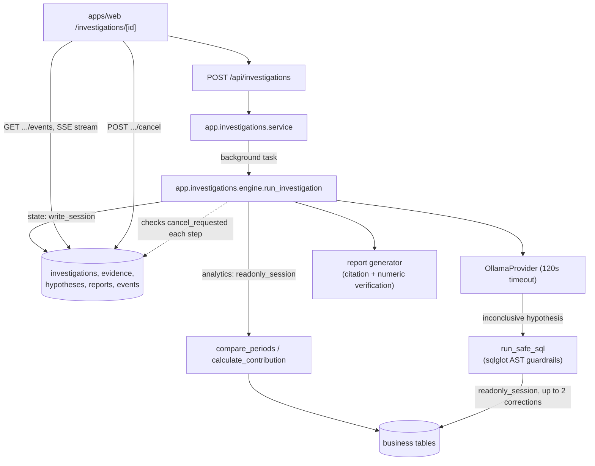

# RootLens architecture overview (Milestones 0–6)

This document describes the system as it exists after all six milestones.
See `RootLens_PRD.md` for the full product requirements; see
`docs/decisions/` for the reasoning behind individual choices.

## Services

```
apps/web   Next.js dashboard, investigation workspace, evaluation reporting
apps/api   FastAPI backend — analytics, investigation engine, evaluation runner
postgres   PostgreSQL 16, source-aligned Olist business tables + app state
ollama     Local LLM (not containerized — reached via host.docker.internal)
```

## Database roles and schemas (ADR-0004, ADR-0007)

- `rootlens_app` — owns the schema. Alembic migrations, ingestion, and
  every write to app state (investigations, evidence, hypotheses,
  reports, events, evaluation runs).
- `rootlens_readonly` — `SELECT`-only on `public`. Used by every
  dashboard/analytics query **and, since Milestone 6, by the
  investigation engine's own analytics reads** (`compare_periods`,
  `calculate_contribution`, the ad hoc `run_safe_sql` tool) — closing the
  gap ADR-0004 originally deferred.
- `public` schema — business tables (orders, customers, order_items, …)
  plus app state.
- `eval` schema (hidden) — `eval_scenarios` / `eval_ground_truth`.
  `rootlens_readonly` has zero privileges here (ADR-0004's default grants
  never covered it); only the evaluation runner and the `/api/evaluations`
  reporting endpoints read it, via the write/app session.
- `scenario_<id>` schemas — ephemeral, one per benchmark scenario, each
  holding a mutated clone of `orders` only. Created and dropped by
  `app.evaluation.scenario_schema`; granted to `rootlens_readonly`
  per-schema at creation time (otherwise the engine's own readonly reads
  would fail against a clone `rootlens_readonly` was never granted).

## Request flow: dashboard (Milestone 1)

```
Browser -> apps/web -> GET /api/metrics/summary -> apps/api
                                                       |
                                                       v
                                     app.analytics.compare_periods
                                     (parameterized SQL, rootlens_readonly)
                                                       |
                                                       v
                                                  PostgreSQL
```

## Request flow: investigation (Milestones 2–4, 6)



`run_investigation` is a **bounded, mostly-deterministic script**, not a
free-form agent loop: three fixed analytics calls (revenue, orders,
cancellation rate) feed one LLM decomposition call, which selects a
drill-down dimension for one contribution calculation. Only when that
leaves the hypothesis `inconclusive` does the engine offer the LLM one
bounded ad hoc SQL step (Milestone 6) before generating the report. Every
step checks the step/query/wall-clock budgets and a `cancel_requested`
flag (Milestone 6) that `POST /api/investigations/{id}/cancel` sets from
a separate request.

## SQL AST guardrails (FR-8, Milestone 6)

`run_safe_sql` is the only place an LLM-generated query is ever executed.
`app.analytics.sql_guardrails.validate_and_bound`:

1. Rejects raw text containing `--` or `/*` before parsing (comment
   smuggling).
2. Parses with `sqlglot`; requires exactly one statement whose root is
   `exp.Select` (a CTE included) — this alone excludes every DDL/DML
   statement at the type level.
3. Walks the AST: every table must be in a small business-table allowlist
   (blocks the hidden `eval` schema and system catalogs); every
   `exp.Anonymous` function call is rejected (this is specifically how
   sqlglot represents a function it can't classify — the shape genuinely
   dangerous calls like `pg_sleep`/`dblink` take; ordinary SQL constructs
   like boolean `OR`/`CASE WHEN` parse into their own named expression
   classes and are never touched by this check); join count is capped.
4. Rewrites the AST to enforce a row limit rather than trusting the
   caller.
5. Executes under `SET LOCAL statement_timeout`, via the readonly role.

The engine allows up to two correction attempts (feeding the validation
error back to the model) before giving up on that one step — never
failing the whole investigation over it.

## Request flow: evaluation (Milestone 5)

```
make eval-seed -> app.evaluation.seed -> eval.eval_scenarios / eval_ground_truth
make eval-run  -> app.evaluation.runner.run_evaluation
                     for each scenario:
                       provision scenario_<id> schema (clone of orders)
                       apply_incident (mutate the clone, seeded)
                       run_investigation (search_path-scoped sessions)
                       score against eval_ground_truth
                       teardown scenario_<id>
                     -> evaluation_runs / evaluation_case_results (public)
                     -> docs/evaluation/results/<run_id>.json

Browser -> apps/web /evaluations -> GET /api/evaluations{,/:id}
```

## What's deliberately still simple

- The investigation loop is a bounded script, not the fully adaptive
  "agent chooses among typed tools every step" loop described in PRD §13
  — the ad hoc SQL step is the one adaptive branch, offered only once,
  only when needed.
- `rootlens_app` is effectively a superuser (the Postgres bootstrap role)
  and can read the hidden `eval` schema regardless of grants — the
  guardrail is that no *application code path* the engine can reach ever
  queries it, not a hard database-level wall against every possible role.
- No SQL AST guardrail work was needed for `compare_periods`/
  `calculate_contribution`/`segment_metric` — they're parameterized,
  hand-written queries that never embed LLM-generated text.
